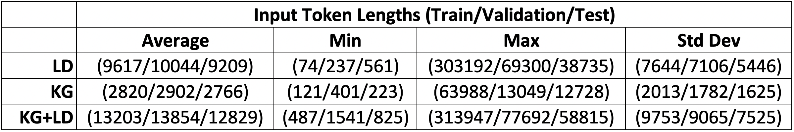

# Summarizing Knowledge-Graph-Augmented Long Documents

By _Patrick O'Callaghan_, _Sheel Sansare_, _Tristan Wang_ as part of the Stanford
CS224W Winter 2023 course project

Our colaboratory notebook provides some additional detail of our codebase.

## To-Do List (Remove When Done) 

1.  Explain objective function we are optimizing during training.

2.  Submit test results to Scrolls.

3.  Present key result that length of summary is strongly dependent on
    input: LD < KG + LD < KG. Explain why this is.

4.  Upload models to Hugging Face.

5.  Figures

6.  Shakespeare image

[comment]: # (7.  The Mirror and the Light (Hilary Mantel).)

8.  Sheel's KG.

9.  Plot distribution of LD, KG, and summary sizes for the 3 splits.

10. Graph convergence of summary length (number of tokens) to 90 for
    LDs, 750 for combined, 800+ for KGs. <see wandb>

11. Training / loss and other graphs from the training. we need to
    discuss training in more detail eg what is the loss function? or how
    does the trainer work? The relevant module is
    [src/utils/custom_seq2seq_trainer.py](src/utils/custom_seq2seq_trainer.py){.uri}
    I think we need to summarize this either in the colab or the blog.
    This custom trainer has minor modifications of
    <https://huggingface.co/docs/transformers/v4.25.1/en/main_classes/trainer#transformers>
    Trainer This means that it uses a standard cross-entropy loss
    function \... adamw optimizer

12. Table of results comparing R1, R2, RL, BERTScore F1 for the 3
    experiments. Bold the best performers.

13. Acknowledge any potential weaknesses in our experimental approach:
    13.1 eg there
    may be an advantage to the combined model. What would we do differently
    with more time: fine-tune for longer summaries using the other two datasets
    (LD and KG alone). Then repeat to see if KG+LD still wins. I don't think
    this is too much of a problem as, if there is no improvement to be made,
    training will quickly halt.
    13.2 training involves truncating the long document to just under 16.5k
    tokens. By putting the KG at the front of the text, we are truncating more
    of the LD. For the longest of documents, the KGs are upto 50k tokens long.

## Introduction 

Long documents are often difficult to understand and summarize. This is
especially true of technical documents such as government reports where entities
are often obscure institutions or less-well-known individuals. Literature
provides one way of dealing with this form of complexity: _introduce a knowledge
graph at the beginning of the text_. Famous examples include the works of
Shakespeare where the main text of each play is preceded by a *dramatis
personea* or *cast of characters* (and their relations).

\<photo\>

In these settings, the role of the knowledge graph is to provide a structured
and easy-to-refer-to characterisation of key entities in the document. A more
extensive example is a complicated historical text such as Hilary Mantel's "The
mirror and the light". There the contents page is followed by seven pages of
structured knowledge-graph-like text.

In this blog post, we explore how knowledge graphs (KGs) can applied to improve
the summarization of long documents. To do so, we exploit a recent innovation in
long-document summarization that allows for documents of arbitrary length called
[unlimiformer](https://arxiv.org/abs/2305.01625).

### Problem Statement 

Until recently long documents were already too long for the limited context
window of attention of transformer models. Whilst the context window is still
limited, various ways to extend the context window have emerged. A natural, yet
counter-intuitive, question then arises:

Will summarization improve if we *extend* or augment a document with its knowledge graph?

Our conjecture is that augmenting long documents with their knowledge graphs
will indeed help large language models generate better summaries of long
documents. Our goal is therefore to build the right datasets, choose the right
architecture and design suitable experiments that will enable us measure any
possible impact of including a "cast of entities" (and their relations) at the
beginning of the document.

### Knowledge Graphs (KGs) of Long Documents (LDs) 

Knowledge graphs stand in contrast with long documents in that they are
structured and concise. They form a significant reduction of the document to
facts (expressed as relations between entities).

We choose the REBEL end-to-end relation extractor to generate our knowledge
graphs.

### Two new KG datasets 

In this project, we generate a new collection of knowledge graphs: one for each
example in the GovReport dataset. This is a significant undertaking for two
reasons:

1. there are approximately 19,500 documents in GovReport;

2. the variance in the length of documents is significant and this leads to
major hardware management issues during generation.

There are significant design choices relating to how relations are specified
and passed to the language model to generate summaries. We specify each KG as a
single sequence of subsequences: one subsequence for each relation triplet in
the KG. We then integrate the collection of KGs with GovReport.

The [first
dataset](https://huggingface.co/patrickocal/gov_report_kg/viewer/gov_report_kg)
replaces each LD in GovReport with a KG. The [second
dataset](https://huggingface.co/datasets/patrickocal/gov_report_kg/viewer/gov_re
port_kg_comb) replaces each LD with a single string that is the concatenation of
the KG and LD.

### Training BART+Unlimiformer 

[Unlimiformer](__) is a recent retrieval-based method for augmenting LLMs at
the decoder level, is the first long-range transformer to support unlimited
length inputs. The key innovation of unlimiformer is to create a datastore of
encodings which correspond to each token in the original document, and use the
$k$-nearest neighbors ($k$-NN) algorithm to select the $k$ most relevant tokens
in the datastore during decoding.

~~~ python
    def search(self, queries, k):
        """
        -search method retrieves the indices of the k closest vectors to query
        """
        if len(queries.shape) == 1: # searching for only 1 vector, add one extra dim
            self.logger.info("Searching for a single vector; unsqueezing")
            queries = queries.unsqueeze(0)
        assert queries.shape[-1] == self.dimension # query vectors are same shape as "key" vectors
        if self.use_flat_index:
            if self.gpu_index:
                scores, values = faiss.knn_gpu(faiss.StandardGpuResources(),
                                               queries,
                                               self.keys,
                                               k,
                                               metric=faiss.METRIC_INNER_PRODUCT,
                                               device=self.device.index
                                               )
~~~

### Our experiments 

Our experiments focus on comparing the summary outputs across the three
datasets: the original GovReports, the GovReportsKG and the GovReportsKG+LD. Our
initial findings reveal significant differences between the summaries generated
from LDs vs the new datasets. The default BART model produces summaries of
approximately 130 tokens with a typical range of 100 to and 150 tokens. In
contrast, the KGs and KG+LDs generated summaries of approximately 900 tokens
with a typical range of 600 to 1100. The target/golden summaries for GovReport
are closer to the latter with the number of tokens being 600 on average with a
typical range of between 400 and 1000.

We explore the cause of these differences and refine our experiments to control
for length of summary. We do so by re-initializing training with a model that
is fine-tuned to produce longer summaries. The goal is to create a fair "horse
race" to compare summarization performance across the three datasets.

### Overview of our final results 

Once we control for length of summary, our final results are in line
with our initial hypothesis. We summarise these results in
[\[fig:summary-of-results-intro\]](#fig:summary-of-results-intro){reference-type="ref"
reference="fig:summary-of-results-intro"}.

We find that the best summaries are indeed produced by the combined KG+LD
input. This is followed by LDs and then finally KGs. There is a
significant difference in performance between the three. All our results
are for the validation set.

## Methodology 

We use

We compare and contrast the LD summaries generated by 3
transformer-based LLM models. Firstly, we train the facebook/BART base
model using the unlimiformer augmentation, which operates on the
entire LD and employs the $k$-NN algorithm. Secondly, we repeat the
previous exercise but with KGs as inputs instead of LDs. Thirdly, we
repeat the previous exercise with string inputs of concatenated KGs and
LDs (in this order).

### Specifics of generating each KG 

Our baseline dataset is the Hugging Face version of GovReport
[@huang2021efficient], a well-established LD summarization dataset with
many practical applications. To generate the required datasets, we use
[REBEL](**paper url**), a pre-trained model that can be found on [Hugging
Face](^2), to perform one-shot named-entity recognition (NER) and relation
extraction (RE). This end-to-end approach stands in contrast to the
traditional two-step approach (eg. Spacy and Stanford ...) We explored
some of the alternatives to REBEL and discuss those in more detail in the
[appendix](#appendix)

##### (fix refs ^)

#### REBEL 

We choose REBEL because at the time of writing it is the [top performing](link)
end-to-end relation extractor on the [DocRED dataset](DocRED paper by Yao et al
[@yao2019DocRED]). Moreover, it is more straightforward and fast to implement
and produced better KGs than the alternatives we tried. Moreover, with more
time to develop our framework, we believe that REBEL would be well-suited to
integration with Unlimiformer to generating KGs at inference time. (The LD
needs to be split into chunks for both KG and summarization, and Unlimiformer is
designed to capture hidden encodings of inputs, so an integration of this form
would be very natural. We leave this extension to future work.)

[comment]: # (
? MORE on the generation methodology here: how are triplets extracted? Does it use an LLM such as BART/BERT ?)
[comment]: # (Pretrained REBEL currently yields the best joint entity and
relation extraction NER and RE results compared with the benchmark among all
models sampled, achieving a relation F1 score of 47.1[^4].)

Given the time and compute resources available to us, through trial and error,
we found that extracting three or four head-relation-tail triplets per 128-token
chunk is optimal. We set the span_length, **parameter**, `num_beams` parameters
to control extraction. Recall that `num_beams` is the maximum number of
candidates (in this case relation triplets) that the attention mechanism will hold over
the `span_length` of text, which is in this case 128 tokens or approximately the
length of a single paragraph.

[code example here]

[comment]: # ( We split the text into 128
token chunks as it is approximately the length of one paragraph. Through visual
inspection, we find that there are typically 3 triples in each paragraph.
Moreover, since REBEL employs beam search, the number of triples must be less
than or equal to the number of beams. We determine that the optimal number of
beams, based on runtime, is 3 beams, which means the maximum triples per chunk
would be 3.)

**put the following comment the figure caption or colab (it's more a comment
for marks than a general interest)**
Once the triplets are extracted, we use NetworkX to create a directed
graph, and MatPlotLib to visualize and plot the results. Below is
a sample image of a knowledge graph produced from a gold summary.

[comment]: # (
\*\*Why extract triplets (and not extract triplets typed)?\*\*
)

#### BART-specific Knowledge Graph representation
We chose to use the beginning of sequence (BOS, '\<s\>') and end of
sequence (EOS, '\</s\>') tokens to separate triples in our knowledge
graphs (KGs) with the intent of aligning with BART's understanding of
sequence boundaries, this approach has specific implications:

1. **Clear Segmentation of Information**: Using BOS and EOS tokens
to delimit triples in the KG makes each triple a distinct segment from
the model's perspective. This is beneficial since we want the model to
treat each triple as an independent unit of information.

2. **Facilitating Attention Across Segments**: This segmentation
should help the model's attention mechanism focus on each triple
individually, potentially enhancing the model's ability to capture the
nuances of each relationship within the KG.

[comment]: # (
3\. **Model Adaptation to Structured Inputs**: Given that BART is
designed to handle structured text, using BOS and EOS tokens in this way
could aid the model in better understanding and generating summaries
based on the structured nature of KGs. It aligns with the model's
pre-existing mechanisms for processing text.)

4. **Potential for Contextual Integration**: While each triple is treated as a
separate sequence, the overall sequence-of-subsequences structure still allows
BART to integrate these segments contextually. The model can still learn to
understand the KG as a whole, even though it processes each triple individually.

[comment]: # (
5. **Efficient Processing of Smaller Units**: By breaking down the
KG into smaller segments, the model might process each unit more
efficiently, especially if the triples are concise and the relationships
within them are straightforward.)

### Specifics of augmenting the GovReport dataset 

#### GovReport 

The GovReport dataset is a well-established long-document summarization
datasets that is both publicly available and ready-to-use. We use it
because it is a large and popluar dataset that has many real-world
applications. The Hugging Face GovReport [^3] dataset has an approximate
$90/5/5\%$ split of approximately $19.5$k document-summary pairs.

## Training 

### Unlimiformer 

\*\*Why unlimiformer, and what is it?\*\* Augmenting large language
models (LLMs) to handle long documents using retrieval-based methods is
a highly active area of research. Since Vaswani et al 2017, transformers
have become the default approach to natural language processing.
Transformers have succeeded due to their ability to capture long range
dependencies between tokens. They do so by abandoning the sequential
approach of recurrent neural networks and instead allowing the decoder
to attend to a complete graph over the encoded hidden states of tokens.
The complexity of complete graphs is therefore quadratic in the number
of tokens. The result is a powerful *attention* mechanism, but one that
is local and restricted to the *context window*. The context window of
ChatGPT-3.5 is 4,096 tokens, while the average novel contains well over
100,000 tokens. Proprietory models such as GPT-4 and Claude provide
users with models that extend beyond 100,000 tokens, but the question
remains: what is the best way to achieve this?

#### Retrieval-Augmentations of LLMs

Unlimiformer stands out for its novel integration of retrieval mechanisms
directly into the Transformer architecture. This integration allows the model to
dynamically access large-scale, a document-specific external (FAISS) datastore
during inference. This datastore is populated with encoded representations of
the full input text. The key advantage of this approach is that it enables
the model to augment its language generation capabilities with contextually
relevant, externally stored information. This is useful for tasks
requiring deep, specific knowledge or for improving the model's ability to stay
updated with recent information.

#### Comparison with Other Methods (Datastore Access)

Unlike traditional methods where datastores are accessed externally or
through separate mechanisms, Unlimiformer integrates the datastore
access internally within its architecture. This internal integration
facilitates a more seamless and efficient interaction between the
model's language processing capabilities and the external knowledge
sources. In contrast, other models might rely on separate retrieval
steps or external systems to incorporate knowledge from datastores,
which can introduce complexity and inefficiency. Unlimiformer's
approach, therefore, represents a significant advancement in making
retrieval-augmented models more streamlined and effective.

This highlights Unlimiformer's innovative approach to enhancing
LLMs with retrieval-augmented capabilities, particularly its unique
internal mechanism for accessing and integrating external datastores.

### BART 

We focused on training the `facebook/bart-base` model (henceforth BART).
Although there now many more advanced models, and many of these (e.g. Llama)
are compatible with Unlimiforemer, BART provides the main benchmark in the
unlimiformer paper [@bertsch2023unlimiformer]. It has a context window of
1024 tokens, anIn addition, each model treats
special tokens slightly differently and, as we shall see, the way tokens are
treated is important to the resulting training on KGs.

BART, like other transformer-based models, is considered adept at
handling structured inputs due to several key features of its
architecture and design. *Structured inputs* refer to data that is
organized in a predictable, often hierarchical manner, with clear
relationships between different parts. This contrasts with unstructured
data, like free-form text, where the organization and relationships are
not as explicitly defined. Examples of structured inputs include:
databases or tables; XML or JSON data, where elements are nested and
have defined relationships; Knowledge graphs, where information is
represented as entities and relationships (triples).

### How we use BART for training 

### Appropriateness of the BART Model 

When training our model, we chose to feed the relational data of our KGs
as tokens into unlimiformer, as opposed to embedding the KGs as
separate relations into vector space. We believe that our approach is
more appropriate as it allows us to better utilize the the
unlimiformer framework, while preserving as much of the KG structure
as possible within the dataset.

\*\*Work to train models individually.\*\*

#### Background on BART 

\*\*Structured Inputs

\*\*Why BART Handles Structured Inputs Well\*\*

1\. \*\*Self-Attention Mechanism\*\*: BART's transformer architecture
uses a self-attention mechanism, which allows it to consider the entire
input sequence at once. This enables the model to understand
relationships between different parts of the input, essential for
structured data.

2\. \*\*Contextual Understanding\*\*: BART can capture context from both
left and right of each token in the input sequence. This bi-directional
context is crucial for understanding structured inputs, where the
meaning often depends on the surrounding elements.

3\. \*\*Layered Encoding\*\*: The layered structure of transformers
enables them to capture and encode different levels of abstraction,
which is beneficial for understanding hierarchical and nested structures
in the input.

4\. \*\*Pre-training on Diverse Data\*\*: BART is pre-trained on a wide
range of data, including structured formats. This pre-training helps it
to learn patterns and structures that are common in various types of
data.

5\. \*\*Flexibility in Input Representation\*\*: BART can handle
sequences with special tokens and delimiters, allowing it to adapt to
different types of structured inputs. For example, it can process inputs
where parts of the data are segmented or highlighted using special
tokens.

6\. \*\*Adaptability to Task-Specific Structures\*\*: With fine-tuning,
BART can adapt to specific types of structured inputs relevant to a
particular task, enhancing its ability to process and generate
meaningful outputs based on that structure.

In summary, BART's ability to process and understand the entire input
sequence contextually, along with its adaptability and pre-training on
diverse data, makes it well-suited for handling structured inputs. This
capability allows it to effectively process and generate outputs based
on inputs like knowledge graphs.

In this context, the slower training times you observed might not be due
to the tokenization strategy per se but could involve other factors such
as the complexity of the relationships in the KGs, the adaptation of the
model to this unique structuring of inputs, or other computational
aspects related to how the BART model processes these inputs.

Your approach aligns with the design principles of transformer models
like BART, which are adept at handling structured inputs. The key would
be to ensure that the rest of your training pipeline, including data
preprocessing and model fine-tuning, is optimized to leverage this
structure effectively.

### Metrics
When it comes to summarizing long documents, metrics like ROUGE and BertScore are critical. They offer a standardized, quantitative way to assess the performance of summarization algorithms.

#### ROUGE Metrics
- **ROUGE-1** measures the overlap of unigrams (individual words) between the system-generated summary and a set of reference summaries. It captures the surface-level accuracy, essentially checking if the key terms appear in the summary.
- **ROUGE-2** measures the overlap of unigrams (individual words) between the system-generated summary and a set of reference summaries. It captures the surface-level accuracy, essentially checking if the key terms appear in the summary.
- **ROUGE-L** focuses on the longest common subsequence between the generated summary and the reference. It can recognize longer phrases that appear in both texts, which reflects a higher level of semantic similarity.
- **ROUGE Geometric Mean** is a composite score that combines ROUGE-1, ROUGE-2, and ROUGE-L (sometimes including others, like ROUGE-SU4) by calculating their geometric mean. It balances the contribution of each metric, offering a more holistic view of the quality of the summary.

#### BertScore
- **BertScore F1** leverages the power of BERT. BertScore computes the similarity of each token in the candidate summary to each token in the reference summary and vice versa, resulting in precision and recall scores. The F1 score is the harmonic mean of these two, providing a balance that considers both the summary's coverage of content and the content's relevance to the summary.

## Results 

\*\*How did our model perform compared to the baseline? Explanation?\*\*

\*\*Why is the average summary 800 words and not 500 words?\*\*

Interpreting the performance differences between models trained on long
documents (LD) and knowledge graphs (KG) based on the provided metrics
involves considering what each metric measures and how that relates to
the nature of the inputs:

1\. \*\*ROUGE Scores\*\*: - \*\*ROUGE-1 (LD: 23, KG: 40)\*\*: This
measures the overlap of unigrams (individual words) between the
generated summary and the reference summary. The substantially higher
score for KG suggests that the KG-based model is better at capturing key
content words. This could be because KGs, being structured and concise,
might enable the model to focus on essential terms more effectively. -
\*\*ROUGE-2 (LD: 11.74, KG: 11.47)\*\*: This metric evaluates bigram
overlap, indicating how well the model captures phrases and specific
content. The similar scores suggest that both models are nearly equally
effective at capturing phrase-level information, though the LD model has
a slight edge. - \*\*ROUGE-L (LD: 14.7, KG: 17.7)\*\*: ROUGE-L assesses
the longest common subsequence, which reflects sentence-level structure
and coherence. The higher score for KG indicates better preservation of
sentence structure or flow from the KG inputs.

2\. \*\*BERTScore\*\*: - \*\*Precision (LD: 0.69, KG: 0.58)\*\*:
Precision measures how much of the content in the generated summary is
relevant or present in the reference summary. The higher precision for
LD implies that it might be better at generating content closely aligned
with the reference, likely due to the richer context provided by the
long document. - \*\*Recall (LD: 0.52, KG: 0.57)\*\*: Recall assesses
how much of the reference summary is captured in the generated summary.
The higher recall for KG suggests it is better at including essential
points from the reference summary, possibly due to the distilled and
focused nature of KGs. - \*\*F1/Aggregated BERTScore (LD: 0.59, KG:
0.57)\*\*: This balanced metric considers both precision and recall. The
scores are quite close, indicating that overall, both models are
similarly effective in terms of content relevance and coverage, though
the LD model has a marginal advantage.

Given these results after 8000 training steps:

\- The KG-based model excels in capturing key content words and
maintaining sentence structure, likely due to the concise and structured
nature of KGs. - The LD-based model, despite its lower performance in
some ROUGE metrics, achieves higher precision in BERTScore, suggesting
its strength in generating summaries that are more aligned with the
content and style of the reference summaries. This might be due to the
rich, contextual information available in long documents. - The marginal
differences in ROUGE-2 and BERTScore/F1 indicate that both models have
their strengths and weaknesses. The LD model seems to be better for
generating precise content, while the KG model is more effective in
covering essential information and maintaining structure.

In conclusion, each model has its advantages depending on the desired
outcome of the summary: whether the focus is on precise content
alignment (LD) or on covering key points and maintaining structure (KG).
Continued training and further optimization could enhance the
performance of both models, potentially narrowing these gaps.

## Conclusion 

\*\*Do we recommend using KGs for LD summarization?\*\*

[^1]: 2023-12-13

[^2]: https://huggingface.co/Babelscape/rebel-large

[^3]: https://huggingface.co/datasets/ccdv/govreport-summarization

[^4]: https://paperswithcode.com/sota/joint-entity-and-relation-extraction-on-3

[^5]: https://spacy.io/usage/large-language-models

[^6]: https://github.com/explosion/spacy-llm/tree/main/usage_examples/rel_openai

[^7]: https://github.com/dwadden/dygiepp

[^8]: https://docs.llamaindex.ai/en/stable/examples/index_structs/knowledge_graph/KnowledgeGraphDemo.html

## Appendix 

### Alternatives to REBEL 

Other means of performing NER and RE we considered include spaCy-LLM,
DyGIE++, and LlamaIndex. spaCy-LLM[^5] is a package that integrates LLMs
into natural language processing (NLP) pipelines provided by spaCy, an
industry-standard NLP library. In particular, its built-in
`spacy.REL.v1`[^6] component supports RE with both zero-shot and
few-shot prompting, but relies on an upstream NER component for entity
extraction.

DyGIE++ is an RE component that refines and scores text spans designed
to capture both intra-sentence and cross-sentence context. We cloned the
code from the official GitHub repository linked here[^7] and attempted
to replicate the process of training a model for RE, but were
unsuccessful due to technical difficulties.

Finally, LlamaIndex, a framework for connecting data sources for LLMs,
has a class called `KnowledgeGraphIndex`[^8] which is compatible with
FAISS, the datastore that unlimiformer uses to conduct $k$-NN searches
of top-level hidden state encodings, which would simplify our task of
NER and RE.
